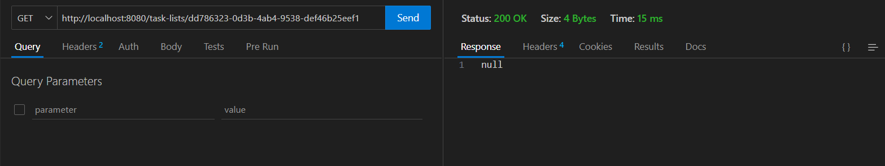
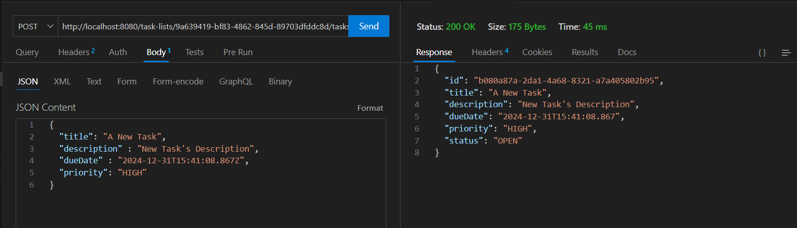

# Task Manager ( Backend )

This Repository contains the backEnd code implemented using spring boot for a Day to Day Task Manager Application. 
As Part of the same you can:
- [Create a Task List](#create-tasklist--post--task-lists-)
- [Edit a Task List](#update-tasklist--put--task-liststask_list_id-)
- [Delete a Task List](#delete-tasklist--delete--task-liststask_list_id-)
- [Create a Task in a Task List](#create-task-in-a-tasklist--post--task-liststask_list_idtasks-)
- [Edit a Task in a Task List](#update-task-in-a-tasklist--put---task-liststask_list_idtaskstask_id-)
- [Delete a Task in a Task List](#delete-task-in-a-tasklist--delete--task-liststask_list_idtaskstask_id-)
- The ID of a Task List and Task are auto generated, so need to provide one.
- A Task List can contain 0 or more Task init.
- Progress of a Task List depends on the number of Tasks completed init.
- A Task can have Due Date, Priority and Status
- `Priority` of a Task can be `HIGH`, `MEDIUM`, `LOW`
- `Status` of a Task can be `OPEN`, `CLOSED`

  

Below are the REST API End points which are created as part of simulating the above functionality.

### Create TaskList ( POST : /task-lists )

### Update TaskList ( PUT : /task-lists/<task_list_id> )

### Delete TaskList ( DELETE : /task-lists/<task_list_id> )

### Get all TaskList ( GET : /task-lists )

### Create Task in a TaskList ( POST : /task-lists/<task_list_id>/tasks )

### Update Task in a TaskList ( PUT :  /task-lists/<task_list_id>/tasks/<task_id> )

### Delete Task in a TaskList ( DELETE : /task-lists/<task_list_id>/tasks/<task_id> )

### Get all Tasks in a TaskList ( GET : /task-lists/<task_list_id>/tasks )

### Deleting TaskList Will delete all Task under it

